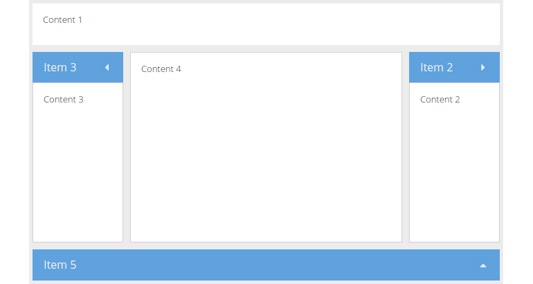

# Panel

A `Panel` is a container designed for building structured blocks for application
oriented user interfaces.

Panels are, by their inheritance from `Ext.container.Container`, capable of being
configured with a layout, and containing child components.

When either specifying child items of a Panel, or dynamically adding Components
to a Panel, remember to consider how you wish the Panel to arrange those child
elements, and whether those child elements need to be sized using one of Ext's
built-in layout schemes. By default, Panels use the Auto scheme. This simply
renders child components, appending them one after the other inside the Container,
and does not apply any sizing at all.

## Exercise

* (Re-)open your `index.html` and extend the `Ext.container.Viewport` to match
  the following snippet:
[include](../snippets/component-panel.js)

It's hardly a difference to our previous examples, differences

xtype: 'panel'
split: false,
margin: 5

# Panel toolbar

A Panel may also contain bottom and top toolbars, along with separate header, footer and body sections.

Panel also provides built-in collapsible, expandable and closable behavior. Panels can be easily dropped into any Container or layout, and the layout and rendering pipeline is completely managed by the framework.

## Exercise

* (Re-)open your `index.html` and extend the `Ext.container.Viewport` items
  by the following snippet:
[include](../snippets/component-panel-toolbar.js)
* Reload the page in the browser and take a look at the result:

