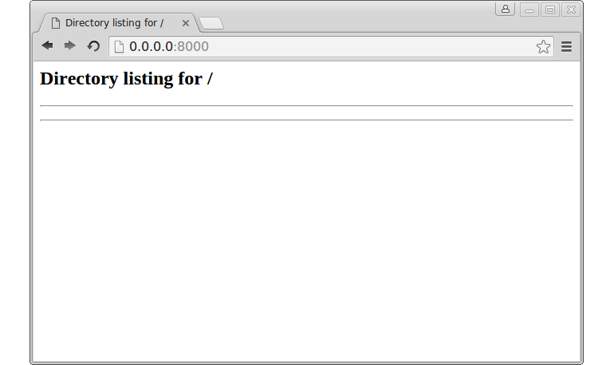

# Workshop setup

The workshop requires a minimum of preliminary work. Please follow the next
steps to set up your workshop environment.

## Prepare workshop folder

In this workshop we're going to learn the basics of Ext JS by the use of simple
consecutive exercises, where we're going to create (and save) HTML files on your
local computer. In order to have a comparable setup, at first we'll create an
appropriate workshop folder, where to put these files in.

* Open the terminal and navigate to your home folder with:
```
$ cd ~
```
* Create a new folder named `{{ book.extWorkshopFolderName }}` with:
```
$ mkdir {{ book.extWorkshopFolderName }}
```
* Enter the newly created directory with:
```
$ cd {{ book.extWorkshopFolderName }}
```

Some examples will need some additional files. Download these files by performing
the following steps:

* Reopen the terminal and download the workshop files into your `{{ book.extWorkshopFolderName }}`
  folder with:
```
$ wget {{ book.extWorkshopMaterialsUrl }}
```
* Extract the downloaded archive file with (this will create a folder named
  `materials` in your workshop directory):
```
$ tar -xvzf {{ book.extWorkshopMaterialsFileName }}
```

## Prepare simple workshop HTTP server

For the first exercises we won't have any need for serving our code snippets
via the HTTP protocol, but in the later parts we're going to use technologies
that require a local HTML server. A very simple way to serve a content of a
specific directory over a web server is to use the [SimpleHTTPServer](https://docs.python.org/2/library/simplehttpserver.html)
module provided by Python.
In the next few steps we're going to start the `SimpleHTTPServer` in the workshop
directory where all upcoming exercise files will be served over the HTTP protocol.

* (optional) Open the terminal and navigate to your workshop folder with:
```
$ cd ~/{{ book.extWorkshopFolderName }}
```
* Run the `SimpleHTTPServer` with:
```
$ python -m SimpleHTTPServer
```

This should give you the following output meaning that the files of the current
directory are served through port number **8000**.
```
Serving HTTP on 0.0.0.0 port 8000 ...
```

* Finally open a web browser and navigate to `{{ book.extWorkshopUrl }}` which
  should give you a listing of all available files in the served web directory.



> **Note** If you want to quit the server, you can either simply quit the
           terminal or press `Ctrl + C`.
