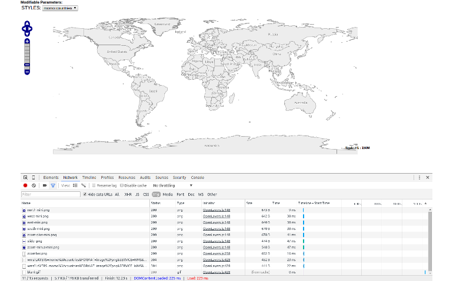

# Checking the cache-headers

Finally we are going to inspect the response send from the GeoServer/GeoWebCache
to the client in more detail. As soon as a layer is being cached by GeoWebCache,
the response headers of single tile are extended by the following HTTP-headers:

| Header | Description |
| ------ | ----------- |
| geowebcache-cache-result | If the tile is delivered by the cache, the value is **HIT** otherwise it's **MISS**. |
| geowebcache-crs | The coordinate system of the tile. |
| geowebcache-gridset | The name of the underlying gridset. |
| geowebcache-tile-bounds | The bounding box of the tile. |
| geowebcache-tile-index | The index of the tile (x, y, z) in the gridset. |

To check if these headers are set, we need to open the GeoServer user interface
again:

1. Go to `Tile Caching` &#10093; `Tile Layers`.
2. Find the layer `momo:countries` and select `momo-4326 / png` under `Preview`.

3. In the preview window/tab press `F12` to open the browsers **Developer Toolbar**,
   activate the `Network` tab, select the `Img` subsection and reload the page
   to record the network activity.

4. Clear the list content with the `Clear` button ()
5. Zoom in to a location of your choice, find a WMS GetMap request in the
   developer toolbar and select it. Explore the right hand sided information panel
   and find the `Response Headers` section. In this you should find the headers
   looking similar the following ones:
```
geowebcache-cache-result:HIT
geowebcache-crs:EPSG:4326
geowebcache-gridset:momo-4326
geowebcache-tile-bounds:158.05400771985825,54.880289022796376,206.3474373941237,103.17371869706184
geowebcache-tile-index:[7, 3, 3]
```
