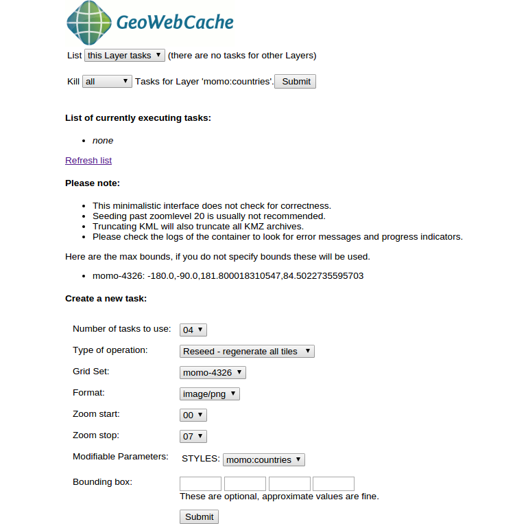

# Generate map tiles

Generally speaking, GWC applies two methods for creating cached map tiles:
1. *On-the-fly processing:* If a GWC layer is primarily requested by a client,
   the appropriate map tiles are rendered and subsequently stored in the GWC
   data directory. The next client, requesting the same layer on the same location
   receives a (much faster) response from the cache.
2. *Preprocessing of map tiles:* The tiles of a layer will be preprocessed and
   stored in a defined bounding box and in defined zoom levels along the given
   gridset. In contrast to the on-the-fly calculation, this method requires,
   depending on the available system resources, significantly more computing
   time, but all clients will receive a direct response from the cache.

With the following steps we'll preprocess the tiles and start the so called
`Seeding` job.

1. Go to `Tile Caching` &#10093; `Tile Layers`.
2. Find the layer `momo:countries` and select `Seed/Truncate`.

3. In the upcoming mask we can configure a GWC-task for seeding the layers
   `countries`. Here we can use the following configuration:
   * *Number of tasks to use:* 04
   * *Type of operation:* Reseed - regenerate all tiles (The option
     `Seed - generate missing tiles` would behave the same here as we haven't
     any cache present)
   * *Grid Set:* momo-4326
   * *Format:* image/png
   * *Zoom start:* 00
   * *Zoom stop:* 07

4. Click `Submit`.
5. In the same window the section `List of currently executing tasks` will be
   filled with the recent tasks and involves some basic informations about it.

6. Depending on your system resources the seeding tasks should not cover more
   than a few minutes. Click `Refresh list` to see if the tasks are finished
   or not.
