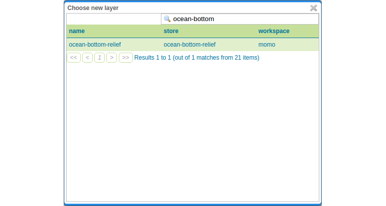
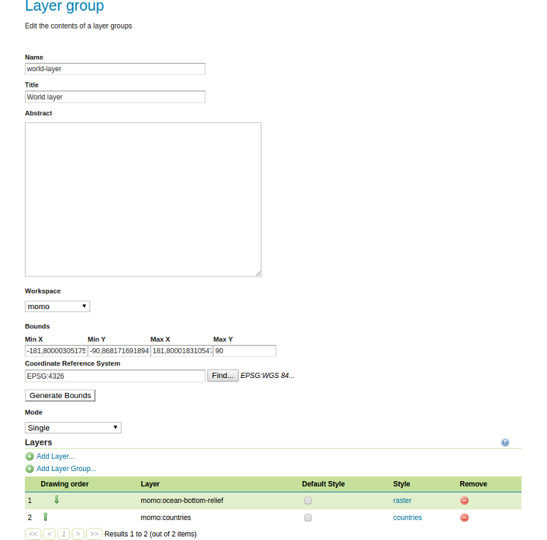

# Layer group

A layer group, as its name suggests, is a collection of layers. A layer group
makes it possible to request multiple layers with a single WMS request. A layer
group contains information about the layers that comprise the layer group, the
order in which they are rendered, the projection, associated styles, and more.
This information can be different from the defaults for each individual layer.

Layer groups do not respect the concept of workspace, and are relevant only to
WMS requests.

# Create grouped layer

Use countries and ocean bottom relief

1. Go to `Data` &#10093; `Layer Groups` &#10093; `Add new layer group`.
2. Create a new layer group as follows:
    * *Name:* world-layer
    * *Title:* World layer
    * *Workspace:* momo
3. Find and select `EPSG:4326` under `Coordinate Reference System`.

4. Click `Layers` &#10093; `Add Layer`, search for `ocean-bottom` and click the
   `ocean-bottom-relief` in the list to add the layer to the group.

5. Repeat the step above for layer `countries`.

6. Let GeoServer generate the bounds for this layer by pressing `Generate bounds`.

7. Click `Save`.
