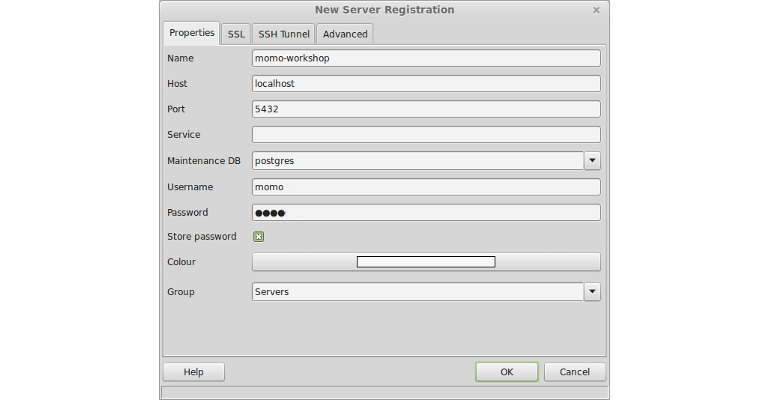

# Prerequisites

Before we can start importing and reading data in this modules, we have to create
a new database on the (already installed) PostgreSQL database server as data
source for new layers. Thus we will use the administration tool `pgAdmin III`.
Let's start by opening it:

* Click `Menu` in the lower left corner and search for `pgadmin`
* In the resulting list select `pgAdmin III` () to
  open the tool.

## Add a new server connection in pgAdmin

Once pgAdmin has started we can create a new connection to our PostgreSQL database
server:

* Create a new server connection by selecting `File` &#10093; `Add Server` in
  the top menu bar and enter the following:
    * *Name:* momo-workshop
    * *Host:* localhost
    * *Port:* 5432
    * *Username:* momo
    * *Password:* momo
    * *Store password:* checked



* Click `OK`

## Creating a database

Now we can connect to this server by a double click on the newly created entry
in the left hand sided `Object browser` (or open the context menu for this entry
and select `Connect` as shown below).


Within the next steps we will create a new database on this database server:

* Open the SQL-Query window by clicking the icon
 in the upper toolbar. Note:
If the icon is greyed out, select the existing database `postgres` first.
* Copy the following SQL block into the SQL-Query window:
```sql
CREATE DATABASE db_momo_ws
    WITH OWNER = momo
    ENCODING = 'UTF8'
    TABLESPACE = pg_default
    CONNECTION LIMIT = -1;
```
* Click `Execute query` () in the upper
  toolbar to run the query.
* After successful execution go back to the `Object browser`, select the server
  and refresh the actual view (by pressing `Refresh the selected object`
  () in the top toolbar) and ensure
  you have a new database entry named `db_momo_ws` present.
* Close the SQL-Query window.

## Creating a schema

Once the database is created, we'll create a new schema in this database. This
schema will be used to store any geodata table we are going to import in this
workshop.

* Select the newly created database `db_momo_ws` in the `Object browser` and
  open the SQL window (). If you
  haven't closed the SQL-Query window before, please verify that you are
  connected to the correct database in the upper toolbar. Otherwise all
  subsequent SQL queries will be executed on the wrong database!
* Copy the following SQL block into the SQL-Query window to create a new schema
  named `geodata`:
```sql
CREATE SCHEMA geodata
    AUTHORIZATION momo;
```
* Click `Execute query` () to run the query.
* Refresh the `Object browser` and ensure the new schema is being created in
  the database `db_momo_ws`.

## Enable spatial functionality

In the final step we will add support for geographic objects by enabling the
spatial database extension PostGIS for our database `db_momo_ws`.

* Open the SQL window (if not already opened) and paste in the following SQL
  block to spatially enable the database `db_momo_ws`:
```sql
CREATE EXTENSION postgis;
```
* Click `Execute query` to run the query.
* Ensure the extension is being successfully installed by executing the
  following query:
```sql
SELECT PostGIS_full_version();
```
   The corresponding output should look like:
```sql
   "POSTGIS="2.1.2 r12389" GEOS="3.4.2-CAPI-1.8.2 r3921" PROJ="Rel. 4.8.0, 6 March 2012" GDAL="GDAL 1.10.1, released 2013/08/26" LIBXML="2.9.1" LIBJSON="UNKNOWN" RASTER"
```
