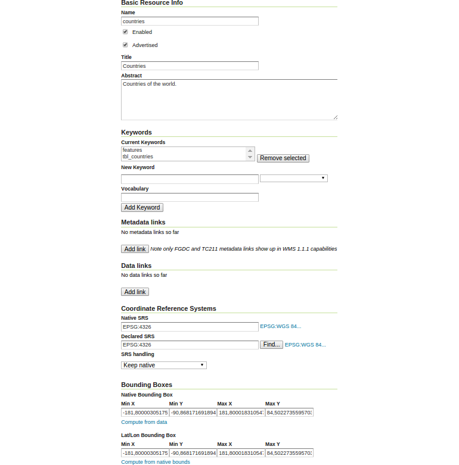

# Layer

A layer (sometimes known as a featuretype) is a collection of geospatial
features or a coverage. Typically a layer contains one type of data (points,
lines, polygons, raster) and has a single identifiable subject (streets, houses,
country boundaries, etc.). A layer corresponds to a table or view from a
database, or an individual file.

GeoServer stores information associated with a layer, such as projection
information, bounding box, and associated styles. Each layer must be associated
with one (and only one) workspace.

## Publishing a layer

Once the new store is created, GeoServer automatically gives us the option of
publishing layers from this store. Here we chose the table `tbl_countries` by
clicking `Publish`.

## Minimal layer configuration

After publishing, GeoServer automatically gives us the option of configuring the
newly created layer. For the moment, we want to set up the layer with some basic
configuration only. Thus we ignore custom styling or caching that will be
handled later on.

1. Configure the new layer as follows:
    * *Name:* countries
    * *Enabled:* checked
    * *Advertised:* checked
    * *Title:* Countries
    * *Abstract:* Countries of the world.
    * *Native SRS:* EPSG:4326
    * *Declared SRS:* EPSG:4326
    * *SRS handling:* Keep native
2. Let GeoServer calculate the bounds of the data by clicking
   `Compute from data`.
3. Convert the native bounds to the Lat/Lon Bounding Box by clicking
   `Compute from native bounds`.
4. Click `Save`.

