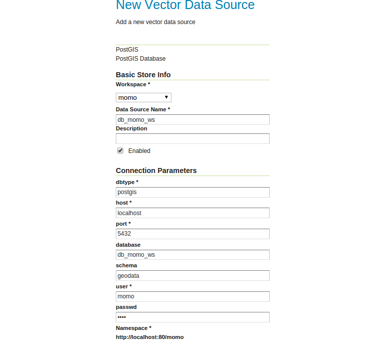

# Store

A store is the name for a container of geographic data. A store refers to a
specific data source, be it a shapefile, database, or any other data source that
GeoServer supports.

A store can contain many layers, such as the case of a database that contains
many tables. A store can also have a single layer, such as in the case of a
shapefile or GeoTIFF. A store must contain at least one layer.

GeoServer saves the connection parameters to each store (the path to the
shapefile, credentials to connect to the database). Each store must also be
associated with one (and only one) workspace.

A store is sometimes referred to as a "datastore" in the context of vector
data, or "coveragestore" in the context of raster (coverage) data.

## Creating a new store

Now we can add a new store to our new workspace `momo`. This store tells
GeoServer how to connect to the data source, in our case the PostgreSQL
database.

1. Navigate to `Data` &#10093; `Stores`.
2. Click `Add new Store`.
3. Click `PostGIS - PostGIS Database`
4. Set the Workspace to `momo` if it isn't set already.
5. Configure the new store as follows:
    * *Data Source Name:* db_momo_ws
    * *Enabled:* checked
    * *dbtype:* postgis
    * *host:* localhost
    * *port:* 5432
    * *database:* db_momo_ws
    * *schema:* geodata
    * *user:* momo
    * *passwd:* momo
6. Click `Save`

